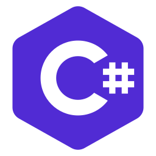

### Hello from Grand Rapids! 👋

#### I'm Vic, your friendly neighborhood technologist.

- 🌎 I'm based in <strong>Grand Rapids</strong>, Michigan
- 💼 I'm currently employed professionally as a software engineering consultant
- ⚡ I’m currently working on a personal website utilizing .NET 8 Blazor, Azure cloud services, and GitHub Actions
- 🌱 I’m currently learning web development, devops automation, and cloud infrastructure
- ❤️‍🔥 I'm passionate about <strong>digital transformation</strong>, the <strong>developer experience</strong>, and solutions that help people <strong>achieve more</strong>
- 📘 I'm actively pursuing cloud certifications for Microsoft Azure
- ☕ I'm <strong>powered by coffee</strong> and an enthusiast of home and local brews
- 📎 I'm the <strong>number one Clippy fan</strong> and here to help
- 🎮 I'm an avid <strong>gamer</strong> and enjoy playing <strong>RPGs</strong> and <strong>indies</strong>
- 📫 Get in touch with me on [Threads](https://threads.net/@thevictorfryeadventure), [LinkedIn](https://linkedin.com/in/victorfrye), or send an [email](mailto:victorfrye@outlook.com)
- 😄 Pronouns: he/him

#### Languages and Tools

<p align="left">
    <a href="https://dotnet.microsoft.com/en-us/languages/csharp" target="_blank" rel="noreferrer">
        
    </a>
    <a href="https://developer.mozilla.org/en-us/docs/web/javascript" target="_blank" rel="noreferrer">
        
    </a>
    <a href="https://dotnet.microsoft.com/en-us/" target="_blank" rel="noreferrer">
        
    </a>
    <a href="https://react.dev/" target="_blank" rel="noreferrer">
        
    </a>
    <a href="https://nodejs.org/en/" target="_blank" rel="noreferrer">
        
    </a>
    <a href="https://git-scm.com/" target="_blank" rel="noreferrer">
        
    </a>
    <a href="https://learn.microsoft.com/en-us/powershell/" target="_blank" rel="noreferrer">
        
    </a>
    <a href="https://www.terraform.io/" target="_blank" rel="noreferrer">
        
    </a>
    <a href="https://azure.microsoft.com/en-us/" target="_blank" rel="noreferrer">
        
    </a>
</p>

#### First Program

My first program was a C# console application in 2017 that is found below. This was created in my Introduction to Programming course at Davenport University.

```csharp
// A simple hello world program in C#
using System;

public class HelloWorld
{
    public static void main(String[] args)
    {
        Console.WriteLine("Hello, world!");
    }
}
```

I have enjoyed recreating hello world programs in different languages and frameworks for myself and as a demonstration of languages I have familiarity with. Samples of these programs can be found [here](./samples/)
